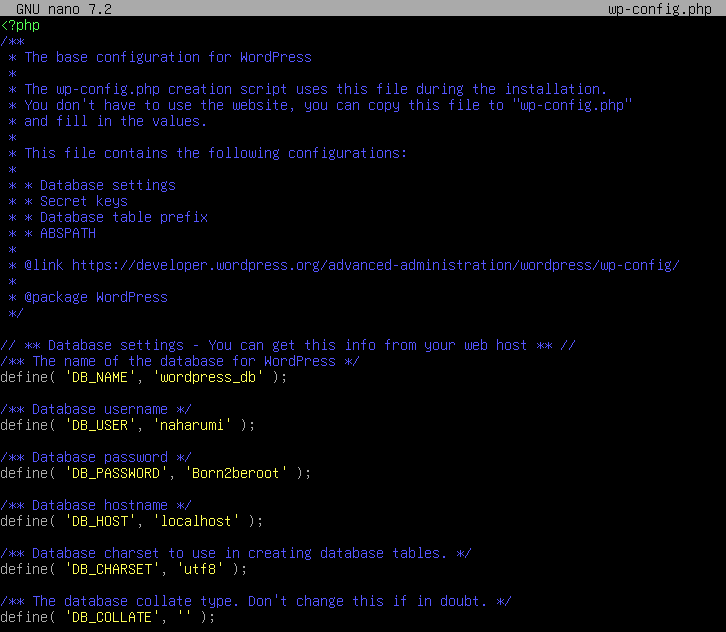

# Born2beroot

This project aims to introduce the world of virtualization.  
I created my first virtual machine in VirtualBox under specific instructions.  

**What is a virtual machine?**<br />
A virtual machine (VM) is a software-based emulation of a computer system that runs an operating system (OS) and applications as if it were a physical machine. Virtual machines allow you to run multiple operating systems on a single physical computer, isolating them from each other.<br /><br />
Its main components are:
* Hypervisor: a layer of software that creates and manages VMs. It allocates resources such as CPU, memory and storage from the host machine to the virtual machines
* Guest OS: the operating system installed inside the virtual machine
* Host OS: the operating system of the physical machine that hosts the VMs
* Virtual hardware: virtualized versions of components like the CPU, memory, disk storage, network adapters and peripherals  

Benefits:
* Resource efficiency: enables better utilization of physical hardware by running multiple VMs on one physical server
* Isolation: VMs are independent of each other, so issues in one VM don't affect others
* Portability: VMs are encapsulated in files, making them easy to move and back up
* Flexibility: you can run different operating systems
* Cost savings: reduces the need for multiple physical machines  

**Debian vs Rocky**
* Debian
  - A community-driven distribution focused on stability, freedom, and reliability
  - Prioritizes open-source software and provides one of the largest software repositories
  - General-purpose operating system

* Rocky
  - A community-driven clone of Red Hat Enterprise Linux (RHEL)
  - Smaller repository focused on enterprise software and tools
  - Enterprise-level operating system designed primarily for servers and enterprise applications  

**apt vs aptitude**
* APT (Advanced Package Tool)
  - A command-line tool for package management - designed for simplicity and efficiency
  - Resolves dependencies but requires manual intervention for complex conflicts
  - Installs only required dependencies, suggested packages can be installed manually if needed
  - Leaves unnecessary dependencies behind unless explicitly cleaned

* Aptitude
  - Offers both a command-line interface (similar to APT) and a text-based, interactive UI, allowing users to navigate packages, browse dependencies and make selections easily
  - Provides multiple solutions for dependency issues and allows users to choose which one to apply
  - By default, installs both required and suggested packages, providing a more comprehensive installation
  - Automatically removes unused dependencies when a package is uninstalled, making cleanup more seamless

**What is AppArmor?**<br />
AppArmor (short for Application Armor) is a Linux kernel security module designed to provide Mandatory Access Control (MAC) to applications, limiting their access to system resources based on predefined security profiles. It aims to enhance the security of a Linux system by restricting what applications and processes can do, minimizing potential damage from vulnerabilities or compromised applications.<br /><br />


## Workflow
1. **VirtualBox** :computer:<br /><br />
VirtualBox is a free and open-source virtualization software developed by Oracle Corporation. It allows users to run multiple operating systems on a single physical computer simultaneously.<br /><br />
It was already installed in my computer, but you can download it [here](https://www.virtualbox.org/wiki/Downloads).<br /><br />

2. **Download Debian** :cd:<br /><br />
Debian is a free and open-source operating system (OS) based on the Linux kernel, known for its stability, security, and extensive package repository. Debian serves as the foundation for many other popular Linux distributions, such as Ubuntu.<br /><br />
Download it [here](https://cdimage.debian.org/debian-cd/current/amd64/iso-cd/). I used the amd64 ISO image.<br /><br />

3. **Setting up the virtual machine** :gear:<br />
    - Name and Operational System:
      - Name: Born2beroot
      - Folder: /nfs/homes/naharumi/VirtualBoxVMs
      - Type: Linux
      - Version: Debian (64-bit) <br />
    - Memory Size:
      - RAM: 1024MB <br />
    - Hard Disk:
      - Create a virtual hard disk now
      - File type: VDI (VirtualBox Disk Image)
      - Storage on physical hard disk: dynamically allocated
      - Size: 32GB <br />
    <br />
    In Settings > Storage > Optical Drive: select the amd64 ISO image<br /><br />

4. **Installing Debian** :cyclone:<br /><br />
I followed this [tutorial](https://github.com/gemartin99/Born2beroot-Tutorial/blob/main/README_EN.md#8--bonus-%EF%B8%8F) to setup manually encrypted partitions using LVM as it is required in the bonus part of the project.<br /><br />
Disk partitioning is the process of dividing a storage disk (such as a hard drive or SSD) into distinct, separate sections called partitions. Each partition behaves as if it were an independent disk, allowing the operating system and users to organize, manage, and use the storage space more effectively.<br /><br />
    <br />
    * Hostname: naharumi42
    * Username: naharumi
    <br />
    
6. **SUDO**<br /><br />
Sudo (super-user do) is a command-line utility in Unix-like operating systems that allows permitted users to execute a command with elevated privileges without needing to fully switch to the root account. This minimizes the risk of unintentional system changes.<br /><br />
Actions taken using sudo are logged, making it easier to track who performed a certain action on the system.<br />

    * Change to admin user (root)
      ```bash
      su
      ```
    
    * Installation
      ```bash
      apt install sudo
      ```  
    
    * Reboot
      ```bash
      sudo reboot
      ```
    
    * Configure `/etc/sudoers.d/sudo_config`
      - Authentication using sudo has to be limited to 3 attempts in the event of an incorrect password
      - A custom messagem has to be displayed if an error due to a wrong password occurs when using sudo
      - Each action has to be archived, both inputs and outputs. The log file has to be saved in the /var/log/sudo folder
      - The TTY (teletypewriter) mode has to be enabled for security reasons
      - The paths that can be used by sudo must be restricted  
        <br />
       ```
       Defaults  passwd_tries=3
       Defaults  badpass_message="Incorrect password, please try again!"
       Defaults  logfile="/var/log/sudo/sudo_config"
       Defaults  log_input, log_output
       Defaults  iolog_dir="/var/log/sudo"
       Defaults  requiretty
       Defaults  secure_path="/usr/local/sbin:/usr/local/bin:/usr/sbin:/usr/bin:/sbin:/bin:/snap/bin"
       ```
   <br />

7. **Users and groups manipulation** :busts_in_silhouette:<br /><br />
In addition to the root user, a user with my login as username must be present and included in `user42` and `sudo` groups.<br />
    
    * Add \<user\>
      ```bash
      sudo adduser naharumi
      ```

    * Change \<user\> password
      ```bash
      sudo passwd naharumi
      ```
    
    * Create \<group\>
      ```bash
      sudo addgroup user42
      ```
    
    * Add \<user\> to \<group\>
      ```bash
      sudo adduser naharumi user42
      ```
    
    * View users inside the \<group\>
      ```bash
      getent group user42
      ```

    * Current \<user\>
      ```bash
      whoiam
      ```

      <br /><br />
    <br />

8. **SSH**<br /><br />
SSH (Secure Shell) is a cryptographic network protocol used for securely accessing and managing computers over an unsecured network. SSH is commonly used for remote login to servers, allowing administrators and users to interact with a machine from a distance.<br />

    * Installation
      ```bash
      sudo apt install openssh-server
      ```

    * Configure
      - `/etc/ssh/ssh_config` (SSH server): change `Port 4242` to allow SSH service to run on port 4242
      - `/etc/ssh/sshd_config` (SSH client): change `Port 4242` to allow SSH service to run on port 4242 only and `PermitRootLogin no` to block SSH connection as root
    
    * In VirtualBox > Settings > Network > Advanced > Port Forwarding > New Rule <br />
      - Host port = 4242
      - Guest port = 4242
     
    * Restart SSH server
      ```bash
      sudo systemctl restart ssh
      ```

    * Check SSH status
      ```bash
      sudo service ssh status
      ```
      <br />

    * To check the SSH connection, in the terminal:
      ```bash
      ssh <username>@<ip> -p 4242
      ssh naharumi@10.12.200.252 -p 4242
      ```
    <br />

9. **UFW Firewall**<br /><br />
UFW (Uncomplicated Firewall) is a user-friendly frontend for managing firewall rules in Linux. It is primarily used to configure and manage the iptables firewall, which is the standard firewall tool in most Linux distributions. UFW supports both IPv4 and IPv6 traffic filtering, ensuring that modern networking protocols are covered.<br /><br />
It helps secure a system by controlling incoming and outgoing network traffic based on predefined rules. By default, UFW denies all incoming connections and allows all outgoing connections, which is a secure starting point.<br />

    * Installation
      ```bash
      sudo apt install ufw
      ```

    * Enable UFW service
      ```bash
      sudo ufw enable
      ```

    * Configure ports
      ```bash
      sudo ufw allow 4242
      ```

    * Check firewall rules and status
      ```bash
      sudo ufw status
      ```
    <br />

10. **Strong password policy** :closed_lock_with_key:<br />
    * Password aging
      - Password has to expire every 30 days
      - The minimum number of days allowed before the modification of a password will be set to 2
      - The user has to receive a warning message 7 days before their password expires

    * Configure `/etc/login.defs`
      <br /><br />
      Note that this will apply only for future created users. To change to current ones you will need to do it one by one:
      ```bash
      sudo chage -M 30 -m 2 -W 7 naharumi
      ```
      <br />

    * Check passowrd status for a \<user\>
      ```bash
      chage -l naharumi
      ```

     * Password complexity
       - At least 10 characters long
       - It must contain an uppercase letter, a lowercase letter and a number
       - It must not contain more than 3 consecutive identical characters
       - The password must not include the name of the user
       - The password must have at least 7 characters that are not part of the former password (except for root)
       - Of course, your root password has to comply with this policy

     * Installation of the Password Quality Checking Library
       ```bash
       sudo apt install libpam-pwquality
       ```
     
     * Configure `/etc/pam.d/common-password`
       ```
       minlen=10         // minimum number of characters
       lcredit=-1        // minimum one lowercase character
       ucredit=-1        // minimum one uppercase character
       dcredit=-1        // minimum one number
       maxrepeat=3       // maximum number of same character repeated
       reject_username   // reject username in password
       difok=7           // minimum 7 characters different from the last password
       enforce_for_root  // add the rule to root user too
       ```

     <br />
    
11. **Monitoring script**<br /><br />
Develop a script in bash that will display the following information in all terminals every 10 minutes:
    * The achitecture of your operating system and its kernel version
    * The number of physical processors
    * The number of virtual processors
    * The current availabe RAM on your server and its utilization rate as a percentage
    * The current available memory on your server and its utilization rate as a percentage
    * The current utilization rate of your processors as a percentage
    * Teh date and time of the last reboot
    * Whether LVM is active or not
    * The number of active connections
    * The number of users using the server
    * The IPv4 address of your server and its MAC (Media Access Control) address
    * The number of commands executed with the sudo program
    <br />
    My script can be viewed in the file [monitoring.sh](monitoring.sh).
    <br /><br />

12. **Cron setup** :alarm_clock:<br />
    * Configure crontab: cron is a time-based job scheduling system in Unix-like operating systems that allows users to run scripts or commands automatically at specified intervals or times
      ```bash
      sudo crontab -u root -e
      ```
      <br />

    * Crontab syntax:
      ```
      * * * * * /path/to/command
      - - - - -
      | | | | |
      | | | | +----- Day of the week (0-7, where 0 and 7 are Sunday)
      | | | +------- Month (1-12)
      | | +--------- Day of the month (1-31)
      | +----------- Hour (0-23)
      +------------- Minute (0-59)
      ```
    
    * To stop cron: `sudo /etc/init.d/cron stop`
    * To start cron: `sudo /etc/init.d/cron start`
    <br />
    
11. **Lighttpd**<br /><br />
Lighttpd is a lightweight, high-performance web server designed to efficiently serve web content with minimal resource usage. It is particularly well-suited for systems with limited hardware resources or environments requiring high-speed and low-memory web server solutions.<br />

    * Installation
      ```bash
      sudo apt install lighttpd
      ```

    * Start and enable Lighttpd service
      ```bash
      sudo systemctl start lighttpd
      sudo systemctl enable lighttpd
      ```

    * Port configuration
      ```bash
      sudo ufw allow 80
      ```
    <br />
    
12. **Wordpress**<br /><br />
WordPress is a free and open-source content management system (CMS) that enables users to create, manage, and publish websites and blogs. It is built on PHP and uses a MySQL or MariaDB database for storing content. WordPress is one of the most popular platforms for building websites, powering over 40% of all websites on the internet due to its flexibility, ease of use, and extensive ecosystem of themes and plugins.<br />

    * Install wget first to download files from the internet
      ```bash
      sudo apt install wget
      ```

    * Download Wordpress to `/var/www/html` directory
      ```bash
      sudo wget http://wordpress.org/latest.tar.gz -P /var/www/html
      ```

    * Extract and redirect files
      ```bash
      sudo tar -xzvf latest.tar.gz
      sudo rm /var/www/html/latest.tar.gz
      sudo cp -r /var/www/html/wordpress/* /var/www/html
      sudo rm -rf /var/www/html/wordpress
      sudo cp /var/www/html/wp-config-sample.php /var/www/html/wp-config.php
      ```

    <br />

13. **MariaDB**<br /><br />
MariaDB is an open-source relational database management system (RDBMS) created as a fork of MySQL. It is designed to be highly compatible with MySQL while offering enhanced performance, additional features, and improved security. MariaDB uses SQL (Structured Query Language) to interact with databases, making it a popular choice for managing data in web applications, enterprise systems, and other software requiring robust database solutions.<br />

    * Installation
      ```bash
      sudo apt install mariadb-server
      ```

    * Run a script to restrict access to the server and remove unused accounts
      - Switch to unix_socket authentication? No
      - Change the root password? No
      - Remove anonymous users? Yes
      - Disallow root login remotely? Yes
      - Remove test database and access to it? Yes
      - Reload privilege tables now? Yes
      ```bash
      sudo mysql_secure_installation
      ```

    * Access MariaDB
      ```bash
      sudo mariadb
      ```
          CREATE DATABASE <database-name>;
          GRANT ALL ON <database-name>.* TO '<username>'@'localhost' IDENTIFIED BY '<password>' WITH GRANT OPTION;
          FLUSH PRIVILEGES;
          exit
    
    <br />
    
14. **PHP**<br /><br />
PHP (Hypertext Preprocessor) is a popular open-source scripting language widely used for web development. It is designed to create dynamic and interactive web pages, and it operates on the server side. PHP code is embedded within HTML or can be executed independently, generating content that is sent to a user's browser.<br />
      
    * Installation
      ```bash
      sudo apt install php-cgi php-mysql
      ```
    <br />
    
15. **Wordpress configuration**<br />

    * Access the `/var/www/html` directory
      ```bash
      cd /var/www/html
      ```

    * Configure the `wp-config.php` file and update database-name, username and password with the values set when the database was created
      <br />
      
    * Enable modules in Lighttpd to improve the performance of web applications on the server
      ```bash
      sudo lighty-enable-mod fastcgi
      sudo lighty-enable-mod fastcgi-php
      sudo service lighttpd force-reload
      ```
    
    <br />

16. **LiteSpeed**<br /><br />
LiteSpeed is a high-performance web server software developed by LiteSpeed Technologies. It serves as an alternative to traditional web servers like Apache and Nginx, offering faster speeds, lower resource usage, and advanced features. LiteSpeed is designed to handle a large number of concurrent connections with efficiency, making it an excellent choice for high-traffic websites and applications.<br />

    * Install curl, a command-line tool and library used to transfer data to or from a server using various network protocols
      ```bash
      sudo apt install curl -y
      ```
    
    * Add OpenLiteSpeed to Debian repository
      ```bash
      wget -O - https://repo.litespeed.sh | sudo bash
      ```

    * Install OpenLiteSpeed
      ```bash
      sudo apt install openlitespeed
      ```
    
    * Configuration
      - User: idroot
      - Password: change password (default is 123456) 
      ```bash
      sudo /usr/local/lsws/admin/misc/admpass.sh
      ```

    * Ports configuration
      ```bash
      sudo ufw allow 8088/tcp
      sudo ufw allow 7080/tcp
      sudo ufw reload
      ```
    <br />

17. **Signature** :memo:<br />
    * Power off the VM
    * Open the terminal and locate the path of the VM
      ```bash
      sha1sum Born2beroot.vdi
      ```
    * Copy the signature and save as signature.txt
    <br />
    :heavy_exclamation_mark: The signature will change everytime the VM is started
